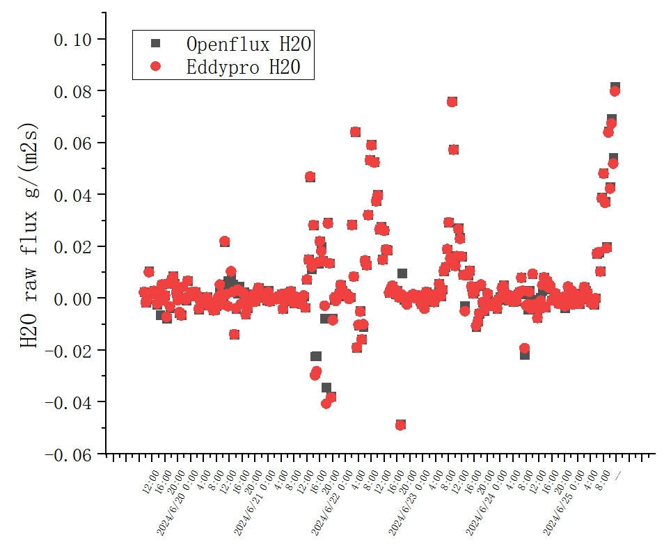

# An Open-Source Online EC Flux Calculation Software
OpenFlux is an online flux calculation software developed by HealthyPhoton Technology. It includes both a data monitor module and a flux calculation module. The software can collect high-frequency data from site observation devices in real time and calculate flux based on specified time intervals
## Project Structure
The following is a brief overview of the key files and directories in this project:
- `OpenFlux.py` – The main program responsible for monitoring and collecting data from various devices.
- `Data_Calculation_Module.py` – Flux calculation programme 
- `README.md` – This documentation file.
- `LICENSE` – The Apache 2.0 license for the project.
## Features
### Monitoring Program
- Real-time monitoring of high-frequency data from multiple instruments
- Store raw data locally at half-hour intervals
### Flux Calculation Program
- Secondary coordinate transformation
- Sonic anemometer temperature correction
- Turbulence stability assessment
- Time lag calculation
- Raw flux calculation

## Installation
You can run this programme on **windows** and **linux** systems. We offer the option to use either a **PC** or **Raspberry Pi** as the hub of the system. OpenFlux is developed and run using Python 3.
In the Python3 environment, we need the following configuration：
- threading
- pyserial
- pandas
- numpy
- logging

For Raspberry Pi setups, additional packages are needed:
- RPi
- pigpio
##  Offline calculation of eddy flux
The original purpose of this program was to collect data in real-time and calculate 
flux online. However, in certain situations, researchers may need to perform offline calculations, 
adjust, and observe changes in the data. Therefore, during the design of the program, 
a modular approach was adopted, with the flux calculation program being written as 
a separate module.

To independently run the eddy covariance flux calculation program, the following preparations are required:
- Program driver code
```python3
if __name__ == "__main__":

    print("Data_Calculation_Module.py")
    filepath = r"./OpenFLux_data" # Set raw data path
    run_data_calculation(filepath,) # Run procedure
```
- Raw data segmented into half-hour intervals
- Columns identical to those in the online calculation software.After updating the new flux calculation program, this table may expand.

| TIMESTAMP |real_time_concentration| ambient_temperature | transmittance | u_axis_speed | v_axis_speed | w_axis_speed | sonic_temp |
|-- |--|--|--|--|--|--|--|
|Required|Required|Optional|Optional|Required|Required|Required|Required|

The results output by the program are consistent with those from the online calculation.

## Notice 
The time in the flux calculation results depends on the start time of the raw data
## Result 
### Raw flux 

## Contributing

We welcome contributions from the community! If you'd like to contribute, please follow these steps:

1. Fork the repository to your own GitHub account.
2. Clone the forked repository to your local machine.
3. Create a new branch for your changes (`git checkout -b my-new-feature`).
4. Make your changes and commit them (`git commit -am 'Add new feature'`).
5. Push your changes to GitHub (`git push origin my-new-feature`).
6. Open a Pull Request on the original repository, describing your changes.

By contributing to this project, you agree that your contributions will be licensed under the Apache License, Version 2.0.
## Contributors

We'd like to extend our thanks to the following people for their contributions:

- [@Weihao Shen](https://github.com/savage1997) – Programme design, systems integration
- [@Wenfeng Ni](https://github.com/ContributorName2) – Monitoring program development 
- [@Haiming Qian](https://github.com/ContributorName2) – Raw flux calculation programme development
- [@Huaiping Wang](https://github.com/ContributorName2) – Raspberry Pi monitoring program development 

If you'd like to become a contributor, see the [Contributing](#contributing) section above.

## License
This project is licensed under the Apache License, Version 2.0，as found in the LICENSE file.
## Copyright

Copyright © 2024,HealthyPhoton Technology.

By contributing to this project, you agree that your contributions will be licensed under the Apache License, Version 2.0.
## Contact Information

For any questions, issues, or contributions, feel free to contact us:

- Email: [weihao.shen@healthyphoton.com](mailto:weihao.shen@healthyphoton.com)
- Email: [openflux@healthyphoton.com](mailto:openflux@healthyphoton.com)
- GitHub Issues: [GitHub Issue Tracker](https://github.com/HealthyPhoton/OpenFlux/issues)
## Acknowledgements

We would like to thank the community for their feedback and contributions.
